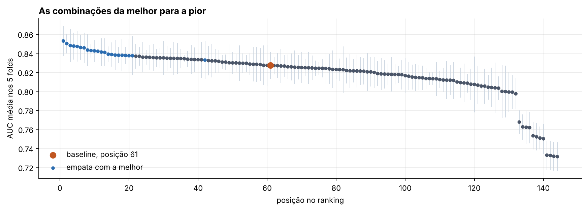
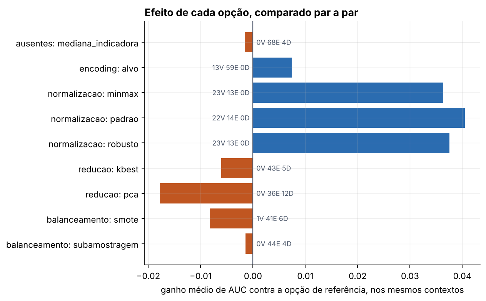

# Prever bilheteria de filme brasileiro antes da estreia

CIN0144 · Aprendizado de Máquina e Ciência de Dados · CIn/UFPE · Grupo 11

Entrega 1: análise exploratória. Entrega 2: pré-processamento e pipelines (última seção).

> Um filme brasileiro vai alcançar público acima do comum para o seu ano, prevendo apenas
> com atributos conhecidos antes da estreia?

A base tem 2.626 filmes brasileiros lançados comercialmente entre 1995 e 2024, com 35
atributos montados a partir da listagem oficial da ANCINE, dos registros de fomento
público, do IPCA e do IBGE.

---

## O principal resultado da Entrega 1

A forma literal de construir o alvo, *sucesso = público acima da mediana da base*, dá
classes equilibradas (50,0% de positivos), mas a mediana global carrega o ano junto:

| década | % de sucesso com a mediana global | com a mediana do ano |
|---|---|---|
| 1990 | 85,6% | 49,0% |
| 2000 | 75,7% | 49,5% |
| 2010 | 50,2% | 49,8% |
| 2020 | 26,3% | 49,7% |

Em 1995 foram lançados 14 filmes brasileiros; em 2024, 197, boa parte deles documentários
de circuito limitado. O público mediano por filme caiu 15 vezes no período. Com a mediana
global, quase todo filme antigo vira sucesso e quase todo filme recente vira fracasso, e um
modelo treinado assim aprende o calendário, não o cinema.

Medimos o peso dos atalhos que a base oferece:

| versão | AUC |
|---|---|
| alvo global, com `renda` e `max_salas`, *k-fold* aleatório | 0,995 |
| alvo relativo ao ano, só atributos pré-estreia, partição temporal | 0,725 |

A auditoria do alvo (`docs/04`) foi além: o público se divide em duas populações, filmes de
circuito limitado e lançamentos comerciais, e a fronteira entre elas fica perto do
percentil 69. Por isso a Entrega 2 usa o percentil 75 do ano anterior como alvo.

---

## Organização

```
├── src/
│   ├── fontes.py              registro das fontes: URL, licenca, cobertura, data de teste
│   ├── ingestao.py            baixa o bruto para data/raw/, com cache
│   ├── build_dataset.py       tipagem, juncoes e definicao dos alvos
│   ├── sensibilidades.py      mede o peso de cada decisao de pre-processamento
│   ├── auditoria_alvo.py      audita a definicao de sucesso
│   ├── executar_e2.py         Entrega 2: roda as 144 combinacoes
│   ├── analisar_e2.py         Entrega 2: tabelas e figuras da analise
│   ├── robustez_e2.py         Entrega 2: as tres checagens de robustez
│   ├── montar_relatorio_e2.py Entrega 2: junta as secoes no relatorio .md e .docx
│   └── e2/                    Entrega 2: base, folds, combinacoes e etapas
├── notebooks/                 notebooks das Entregas 1 e 2, executados
├── docs/
│   ├── 00-guia-do-projeto.md  por onde comecar
│   ├── 01-fontes-de-dados.md  fontes usadas e descartadas
│   ├── 02-decisoes-e-escopo.md decisoes D1 a D9
│   ├── 03-melhorias-e-tradeoffs.md  sensibilidades S1 a S6 e melhorias M1 a M9
│   ├── 04-auditoria-do-alvo.md  o que conta como sucesso de bilheteria
│   ├── relatorio-entrega1.md  relatorio da Entrega 1, versao tecnica
│   ├── roteiro-apresentacao.md roteiro da apresentacao da Entrega 1
│   └── e2/
│       ├── Relatorio_Entrega_2_Grupo_11.pdf  relatorio da Entrega 2, versao entregue
│       ├── relatorio-entrega2.md  rascunho de trabalho, montado a partir das secoes
│       ├── Relatorio_Entrega_2_Grupo_11.docx  o rascunho em .docx, gerado pelo script
│       ├── estilo-relatorio.docx  modelo de estilos do .docx
│       ├── hipoteses-balanceamento.md  o que esperavamos antes da grade e o veredito
│       └── secoes/            uma secao por arquivo, com a dona de cada uma
├── data/
│   ├── raw/                   bruto, versionado de proposito
│   └── processed/filmes.csv   base analitica, 2.626 x 35
├── reports/                   tabelas e figuras geradas pelos scripts
└── tests/                     testes rapidos
```

## Como rodar

Python 3.12 ou superior. Nenhuma fonte exige cadastro, chave de API ou aceite de termos.

```bash
pip install -r requirements.txt
python src/ingestao.py        # baixa o bruto; com cache, repetir nao vai a rede
python src/build_dataset.py   # monta data/processed/filmes.csv
python src/sensibilidades.py  # as seis analises de sensibilidade
python src/auditoria_alvo.py  # tabelas reports/alvo_*.csv e a figura 12
python -m unittest discover -s tests
jupyter lab notebooks/
```

Se o certificado de algum servidor do gov.br falhar na ingestão, rode
`python src/ingestao.py --sem-verificar-ssl`. O padrão é verificar.

---

## Fontes

| fonte | órgão | uso | licença |
|---|---|---|---|
| Listagem dos Filmes Brasileiros Lançados 1995–2024 | ANCINE / OCA | base primária, 2.626 filmes | dado aberto federal |
| Obras com Investimento do FSA | ANCINE | fomento direto, junção por CPB | CC-BY |
| Obras com Fomento Indireto Aprovado | ANCINE | leis de incentivo, junção por CPB | CC-BY |
| IPCA, série 433 do SGS | Banco Central | deflacionar a renda para reais de 2024 | dado aberto federal |
| População residente estimada, agregado 6579 | IBGE | contexto de mercado | dado aberto federal |

Os dados abertos federais seguem a Lei 12.527/2011 e o Decreto 8.777/2016: uso livre, com
citação da fonte. A listagem 1995–2025, citada em algumas referências, não estava publicada
em 10/09/2026; as URLs de 2025 devolvem 404, e trabalhamos com 1995–2024.

As fontes testadas e descartadas, com o motivo, estão em `fontes.DESCARTADAS`. Entre elas
está o Wikidata, que traria a duração dos filmes, mas cujo endereço não respondeu na rede
em que trabalhamos.

---

## Entrega 1: análise exploratória e hipóteses

O público tem cauda muito longa: mediana de 2.806 espectadores e média de 148.399,
assimetria 10,0 e curtose 135,2. O 1% de filmes de maior público concentra 36% do total; a
metade de menor público fica com 0,28%.

O relatório lista quinze problemas. Quatro são estruturais: o alvo global que carrega o
ano, o vazamento por `renda`, o vazamento provável por `max_salas` e a assimetria. Os
outros vão da cardinalidade, com 467 distribuidoras, à ausência não aleatória de
`max_salas` e ao campo de UF malformado. A auditoria do alvo acrescentou dois: um quinto
dos rótulos cai dentro do intervalo de confiança da mediana do ano, e essa mediana só é
conhecida em dezembro, depois da estreia.

Três hipóteses são de não fazer: não balancear, porque o alvo na mediana é 50/50 por
construção; não remover a cauda como *outlier*, porque ela é o próprio fenômeno; e não
aplicar PCA, porque o excesso de dimensão vem das categóricas. A Entrega 2 revê a
primeira e a última.

Cada hipótese foi medida por `src/sensibilidades.py`, com floresta aleatória, 5-fold
estratificado e todo o pré-processamento dentro dos folds. O modelo serve só para comparar
duas versões da base; nenhum destes números é o desempenho do trabalho.

| # | pergunta | resposta |
|---|---|---|
| S1 | quanto vale cada atributo posterior ao lançamento? | `max_salas` +0,108 · `renda` +0,161 |
| S2 | mediana global ou mediana do ano? | o alvo relativo custa 0,062 e elimina o atalho |
| S3 | partição aleatória ou temporal? | a aleatória é 0,087 otimista |
| S4 | como tratar 467 distribuidoras? | `min_frequency` 5 a 15: −0,009 de AUC e −380 colunas |
| S5 | `log1p` ajuda? | +0,024 na regressão logística, 0,000 na floresta |
| S6 | remover `n_ufs`, com moda em 97,1%? | 0,000 |

Entregáveis da Entrega 1: o notebook em `notebooks/`, o relatório em `docs/` (versão
técnica em Markdown e versão de entrega em `.docx`) e as figuras em `reports/figuras/`.

---

## Entrega 2: pré-processamento e pipelines

A pergunta passa a ser quanto cada etapa de preparação dos dados muda o desempenho de um
kNN com k = 7 fixo. São 144 combinações, todas avaliadas nos mesmos cinco folds.

O alvo segue a recomendação da Entrega 1: sucesso é público acima do percentil 75 dos
filmes brasileiros do ano anterior, um limiar que já existe antes da estreia. Ficam 2.590
filmes, 25,3% deles sucesso. Entram três atributos de histórico de sucesso, da direção, da
distribuidora e da produtora, calculados só com anos anteriores.

Com esse alvo a classe de sucesso é 1 para 3, e o balanceamento passa a fazer sentido. E o
kNN, ao contrário da floresta usada na Entrega 1, é sensível a escala e a dimensão, então a
redução de dimensionalidade volta à grade. Cada etapa mantém a opção "sem", para que as
duas decisões da Entrega 1 sejam testadas.

| etapa | opções |
|---|---|
| valores ausentes | mediana e moda · mediana com indicadora de ausência |
| encoding | one-hot com agrupamento de raras · encoding pelo alvo |
| normalização | sem · z-score · min-max · robusta |
| redução | sem · PCA · seleção de atributos |
| balanceamento | sem · subamostragem · SMOTE |

Dentro de cada fold a ordem é `ausentes → encoding → normalização → redução →
balanceamento → kNN`; o motivo de cada posição está em `src/e2/espaco.py`.

```bash
python src/e2/base.py         # resumo da base e teste de que o historico nao vaza
python src/executar_e2.py     # roda as 144, cerca de 4 minutos; retoma de onde parou
python src/analisar_e2.py     # empate, ranking, efeitos, interacoes, custo e figuras
python src/robustez_e2.py     # particao temporal, cortes P50 e P90, e por genero
python src/e2/anexo.py        # tabela das 144 para o anexo
python src/montar_relatorio_e2.py --docx  # junta as secoes no relatorio; o .docx pede pandoc
```

A grade rodou sem nenhuma combinação com erro, e rodá-la duas vezes dá as mesmas métricas.

Entregáveis da Entrega 2: o notebook em `notebooks/`, que refaz a grade e confere que ela
bate com `reports/e2/resultados.csv`, o relatório entregue em
`docs/e2/Relatorio_Entrega_2_Grupo_11.pdf`, com o corpo em menos de dez páginas, e as
figuras em `reports/figuras/e2/`. As seções em `docs/e2/secoes/` e o
`relatorio-entrega2.md` são o rascunho de onde o texto final saiu.

Os resultados vão para `reports/e2/`: `resultados.csv` com uma linha por combinação,
`resultados_por_fold.csv` com uma por combinação e fold, `folds.csv` e `ambiente.json`
com as versões das bibliotecas.

---

## Entrega 2: resultados e conclusões

As **144 combinações de pré-processamento** foram executadas sem erros, com kNN de 7 vizinhos e validação cruzada em cinco folds. A AUC variou de **0,731 a 0,853**, mostrando o impacto das escolhas de preparação dos dados.

### Comparação dos pipelines

| Configuração | AUC |
|---|---|
| Melhor: encoding pelo alvo, padronização, PCA e subamostragem | **0,853 ± 0,016** |
| Baseline: sem transformações opcionais | **0,827 ± 0,014** |
| Pior: indicadora, one-hot, PCA sem normalização e subamostragem | **0,731 ± 0,015** |

Apesar das diferenças, **104 das outras 143 combinações empataram com o baseline**, considerando a variabilidade entre folds.



### Efeito das técnicas

A **normalização** foi a etapa mais importante, com 68 vitórias, 40 empates e nenhuma derrota em 108 comparações. As três escalas tiveram desempenho semelhante.

O encoding pelo alvo apresentou uma pequena vantagem sobre o one-hot. Já a redução de dimensionalidade não melhorou a AUC, embora a seleção de atributos tenha empatado com a ausência de redução em **43 dos 48 contextos**.



### Interações entre etapas

O efeito de uma técnica também depende das anteriores. O **PCA sem normalização** reduziu os dados a apenas dois componentes e causou uma perda média de **0,065 de AUC**. Com normalização, esse prejuízo praticamente desapareceu.

A normalização também apresentou ganhos maiores quando combinada ao encoding pelo alvo.


### Balanceamento e custo

A subamostragem aumentou a revocação de **0,547 para 0,741**, mas reduziu a precisão de **0,692 para 0,543**. Assim, o modelo encontrou mais sucessos, porém com mais falsos positivos.

A grade completa levou **3,9 minutos**. A seleção por informação mútua e o one-hot foram as opções mais caras, enquanto a normalização teve custo adicional praticamente desprezível.

### Robustez e limitações

Na validação temporal, com treino até 2017 e teste a partir de 2018, o baseline caiu de **0,827 para 0,588 de AUC**, enquanto a melhor combinação passou de **0,853 para 0,793**.


A maior limitação apareceu nos documentários: a revocação da melhor combinação foi de apenas **0,118**, contra **0,826 em filmes de ficção**.

**Conclusão:** a normalização foi a decisão mais importante, mas a ordem das etapas e a validação temporal também se mostraram fundamentais. O pré-processamento não apenas melhora métricas: ele muda o que o modelo aprende.

---

## Licença

Código sob [licença MIT](LICENSE). Os dados pertencem aos órgãos que os publicam e são
redistribuídos aqui como dado aberto, com citação da fonte; ver
[`NOTICE-DADOS.md`](NOTICE-DADOS.md).
