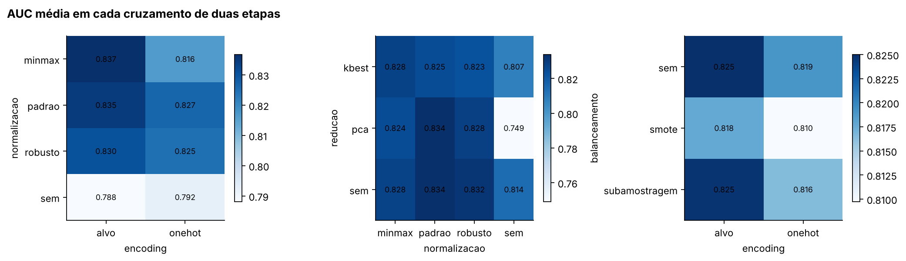

# 5.3 · Interações

> Dona: Ana Laura · Orçamento: parte das 4,0 páginas da §5

O enunciado define interação como a técnica que só se mostra benéfica na presença de outra. O
módulo de análise procura isso sem intervenção: compara cada opção com a sua referência dentro de
cada recorte da outra etapa e marca interação quando o veredito muda de recorte para recorte. Na AUC,
dois pares foram marcados.

**A redução depende da normalização.**

| PCA contra não reduzir, por normalização | vitórias, empates, derrotas | ganho médio | veredito |
|---|---|---|---|
| com padronização | 0, 12, 0 | +0,000 | empate |
| com escala por intervalo | 0, 12, 0 | −0,003 | empate |
| com escala robusta | 0, 12, 0 | −0,003 | empate |
| sem normalização | 0, 0, 12 | **−0,065** | perde |

O PCA empata com não reduzir nos 36 contextos em que há normalização e perde nos 12 em que não há.
A causa não é conjetura: a grade registra quantas colunas chegam ao classificador, e nas
combinações de PCA sem normalização esse número é 2,0. O corte de 95% da variância sai em dois
componentes, o que faz sentido, porque sem correção de escala a variância total é quase toda da
contagem de filmes anteriores da distribuidora e do ano; dois componentes bastam para reproduzir
essas duas colunas, e os demais atributos cabem nos 5% descartados. O classificador recebe um
espaço de duas dimensões que sabe apenas o porte da distribuidora e o ano, e as doze piores
combinações do ranking são exatamente essas.

O teste pareado acrescenta uma leitura. Sem normalização, a perda de 0,065 tem p = 2 · 10⁻¹¹ em
sessenta pares; com normalização, a perda média cai a 0,002 e o teste ainda acusa p = 0,003, porque
o efeito é minúsculo mas sistemático. É o caso didático da diferença entre as duas leituras:
significativo não quer dizer relevante, e 0,002 de AUC está sete vezes abaixo do desvio entre
folds. Pela regra do enunciado, que é o critério adotado, isso é empate.

A consequência é uma regra de ordem, não uma preferência de técnica: num pipeline com kNN, a
redução por componentes principais precisa vir depois de uma escala, e um pipeline que inverta essa
ordem não é subótimo, é um erro de construção. A seleção por informação mútua não apresenta esse
comportamento, porque escolhe colunas por associação com o alvo, e associação não depende da
unidade em que a coluna está medida.

**A normalização rende mais com o encoding pelo alvo.**

| normalização contra não normalizar | com encoding pelo alvo | com one-hot |
|---|---|---|
| padronização | 15, 3, 0 · ganho +0,047 · vence | 7, 11, 0 · ganho +0,035 · empate |
| escala por intervalo | 17, 1, 0 · ganho +0,049 · vence | 6, 12, 0 · ganho +0,024 · empate |
| escala robusta | 15, 3, 0 · ganho +0,042 · vence | 8, 10, 0 · ganho +0,033 · empate |

As três vencem no espaço do encoding pelo alvo e apenas empatam no do one-hot, e é essa mudança de
veredito que caracteriza a interação. Nenhuma chega a perder em qualquer recorte, de modo que a
recomendação de normalizar não muda; o que muda é quanto se ganha.

O resultado tem forma diferente da prevista na §3.3. Esperávamos que a padronização sofresse no
one-hot pelo fator 9,9 das binárias raras, e que a escala por intervalo fosse a mais segura ali. O
medido mostra o contrário: a escala por intervalo é a que mais perde ao sair do encoding pelo alvo
para o one-hot, de 0,049 para 0,024, enquanto a padronização cai menos, de 0,047 para 0,035.

A explicação inverte o nosso próprio argumento. A escala por intervalo não mexe nas colunas
binárias, mas comprime as numéricas de cauda longa para uma faixa estreita perto de zero, já que
são governadas pelo máximo; as dezenas de colunas binárias do one-hot passam a ter amplitude
efetiva maior que as numéricas e dominam a distância. A padronização iguala a dispersão de todas as
colunas, inclusive as binárias, e impede que qualquer grupo domine. Quanto ao fator 9,9, a
explicação provável para a sua ausência está numa decisão da etapa anterior: o one-hot agrupa as
categorias com menos de dez filmes, de modo que as colunas raríssimas das quais o argumento
dependia não chegam a existir. É hipótese compatível com o medido, não efeito isolado; isolá-lo
exigiria rodar a grade sem esse agrupamento, o que fica como extensão na §7.

O par balanceamento e normalização não é interação na AUC, em que as duas técnicas empatam com não
balancear pelo veredito de cada recorte, mas é no F1. Sem normalização, balancear vence em F1, a
subamostragem em oito dos doze contextos e o SMOTE em nove; com qualquer escala, o veredito passa a
empate. O kNN sem escala é o que mais erra por não alcançar quatro votos de sucesso, e é ali que
inflar a classe rara mais rende. Na AUC sobra só a magnitude: a subamostragem tem ganho médio de
−0,013 sem normalização, com quatro derrotas, e de +0,007 com padronização, porque descartar metade
dos filmes reduz a densidade de vizinhos, o que agrava um espaço já decidido por duas colunas e se
paga num espaço escalado.
