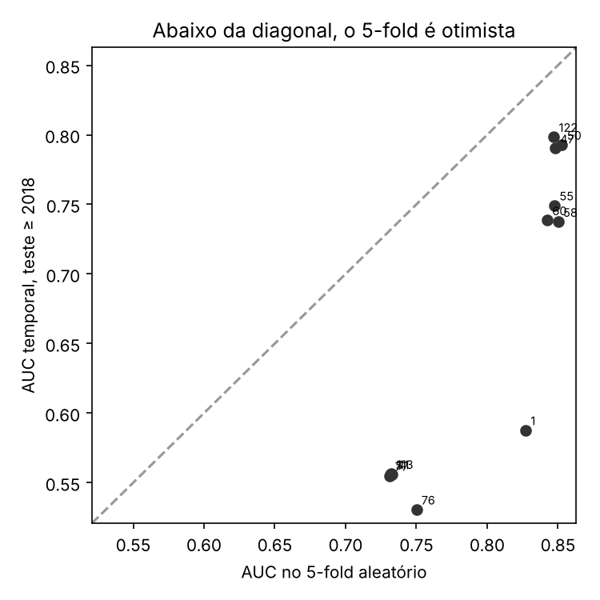

# 6 · Robustez: temporal, P50/P90, por gênero

> Dona: Laura · Orçamento: 0,75 página

A §5 mede tudo sob um único arranjo. Esta seção pergunta o que sobrevive quando ele muda. Doze
combinações passaram pelas três checagens: o baseline, as cinco melhores, as cinco piores e a
melhor de cada opção de balanceamento.

**Validação temporal.** Treino até 2017, teste de 2018 em diante, que é a validação defendida pela
E1 e substituída pelo enunciado desta entrega.

| combinação | AUC em cinco folds | AUC temporal | otimismo |
|---|---|---|---|
| baseline, sem transformação opcional | 0,827 | 0,588 | 0,239 |
| indicadora, alvo, padronização, PCA, subamostragem | 0,847 | 0,799 | 0,049 |
| alvo, padronização, PCA, subamostragem | 0,853 | 0,793 | 0,060 |
| alvo, padronização, subamostragem | 0,848 | 0,790 | 0,058 |
| alvo, escala por intervalo, PCA | 0,850 | 0,738 | 0,113 |
| alvo, escala por intervalo | 0,848 | 0,749 | 0,098 |
| alvo, escala por intervalo, PCA, SMOTE | 0,842 | 0,739 | 0,104 |
| PCA sem normalização, cinco variantes | 0,731 a 0,750 | 0,531 a 0,556 | 0,176 a 0,219 |

Todas as doze são otimistas na divisão aleatória, o que a §4 já declarava. O que não esperávamos é
a distribuição desse otimismo: o baseline é o mais otimista de todos e cai para 0,588, quase o
acaso, enquanto as três com padronização, encoding pelo alvo e subamostragem perdem entre 0,049 e
0,060 e seguem acima de 0,79. As três com escala por intervalo perdem o dobro, de 0,098 a 0,113.

O pré-processamento, portanto, não melhora apenas o número do relatório: muda o que o modelo
aprende. Sem escala, a distância é decidida pelo ano e pela contagem de filmes anteriores da
distribuidora, como mostrou a §5.3, e as duas crescem com o tempo: todo filme do teste é de um ano
que o treino não tem, e as distribuidoras chegam ao teste com mais filmes acumulados do que tinham
no treino. Na divisão aleatória o vizinho mais próximo tende a ser de um ano próximo; no futuro, é
só o filme mais recente do treino. As combinações de PCA sem normalização, que guardam apenas essas
duas colunas, têm otimismo próximo ao do baseline, e a padronização, que as põe no mesmo peso das
demais, é a que menos perde. A escala por intervalo fica no meio por depender do máximo do treino,
que o teste ultrapassa.

Isso qualifica a §5.1. As seis combinações com normalização desta tabela empatam com a melhor em
cinco folds e, no futuro, ficam entre 0,738 e 0,799: empate sob um protocolo não é equivalência
sob outro.

**Troca do corte do alvo.** Nos percentis 50, 75 e 90 do ano anterior, a correlação de Spearman
entre as ordenações é de 0,825 entre P50 e P75, de 0,867 entre P75 e P90 e de 0,664 entre P50 e
P90, todas significativas: a ordenação é estável e menos estável nos extremos, o que é natural
porque P50 e P90 definem problemas diferentes. A separação qualitativa não muda: nos três cortes as
combinações com normalização e encoding pelo alvo ficam entre 0,770 e 0,880, e as de PCA sem
normalização entre 0,711 e 0,750.

**Desempenho por gênero.** A terceira checagem revela a limitação mais séria do modelo.

| gênero | filmes | prevalência | AUC no baseline | AUC na melhor | revocação na melhor |
|---|---|---|---|---|---|
| ficção | 1.627 | 35,6% | 0,813 | 0,832 | 0,826 |
| documentário | 908 | 5,6% | 0,699 | 0,693 | 0,118 |

O agregado esconde dois problemas: a AUC cai cerca de 0,13 em documentário, o que indica que os
atributos descrevem mal o que faz um documentário encontrar plateia, e a revocação em documentário
é de 0,118 na melhor combinação, contra 0,826 em ficção. Mesmo o melhor pipeline encontra menos de
um em cada oito documentários de sucesso. O mecanismo é o do balanceamento levado ao extremo:
com prevalência de 5,6%, menos de um dos sete vizinhos de um documentário típico é sucesso, e o
corte de quatro votos em sete fica inalcançável. Balancear o conjunto inteiro não resolve, porque
equaliza a proporção global e não a da vizinhança em que o documentário vive.
